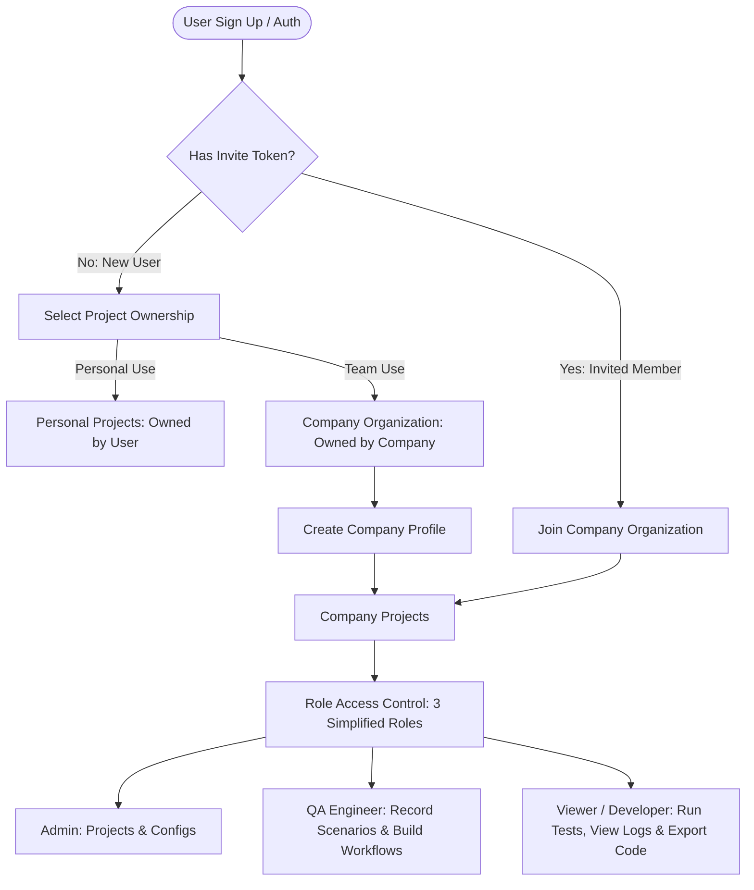
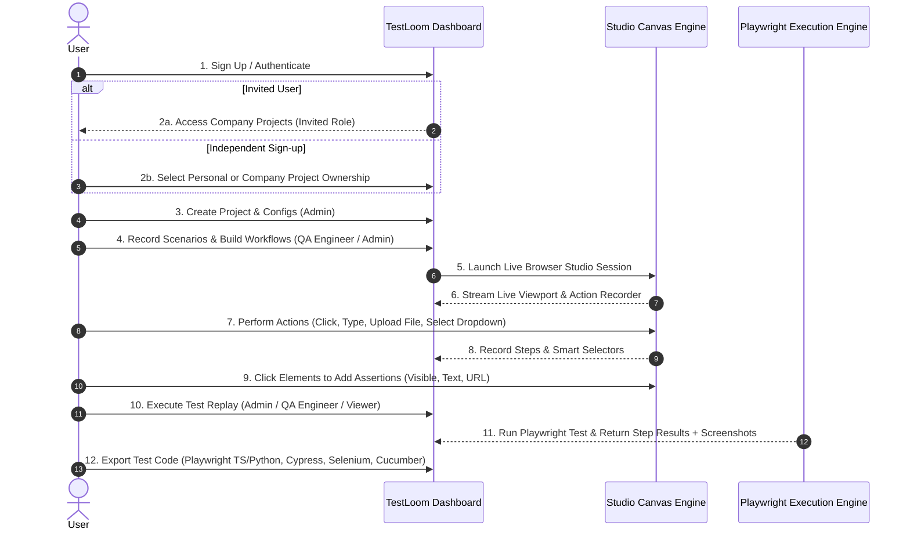
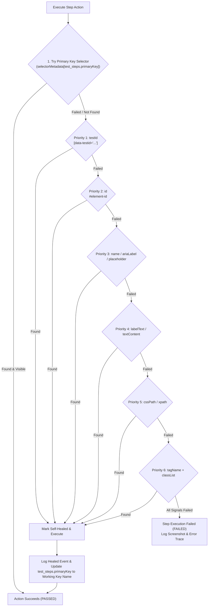

# TestLoom — Architecture

This document describes how TestLoom is structured: the access model, core domain concepts, execution engine behavior, and repository conventions. For the full data model, see [`dbschema.md`](./dbschema.md). For a product-level summary, see [`README.md`](./README.md).

---

## 1. Tech Stack

| Layer             | Choice                                                         |
| :---------------- | :------------------------------------------------------------- |
| Framework         | Next.js 16 (App Router)                                        |
| UI runtime        | React 19                                                       |
| Language          | TypeScript 5                                                   |
| UI primitives     | `@base-ui/react`, generated into `components/ui/` via `shadcn` |
| Styling           | Tailwind CSS 4 + `tw-animate-css`                              |
| Icons             | `lucide-react`                                                 |
| Theming           | `next-themes`                                                  |
| Forms             | `react-hook-form` + `@hookform/resolvers`                      |
| Validation        | `zod`                                                          |
| Dates             | `date-fns` + `react-day-picker`                                |
| Automation engine | `playwright` (Studio recorder + Execution Engine)              |

---

## 2. Access & Ownership Model

TestLoom is a **direct multi-tenant** system with **3 roles**: `ADMIN`, `QA_ENGINEER`, `VIEWER`.

A project is owned by **either** an individual user **or** a company organization — never both, never neither. This should be enforced as an application-layer invariant on `projects` (see `dbschema.md` §Layer 3).

### 2.1 Onboarding Flow



### 2.2 Permission Matrix

| System Task / Capability                | Admin | QA Engineer | Viewer / Developer |
| :-------------------------------------- | :---: | :---------: | :----------------: |
| Manage Team Invites & Roles             |  ✅   |     ❌      |         ❌         |
| Create & Delete Projects                |  ✅   |     ❌      |         ❌         |
| Configure Base URL, Viewport & Env Vars |  ✅   |     ❌      |         ❌         |
| Record Test Scenarios in Studio         |  ✅   |     ✅      |         ❌         |
| Edit Test Steps & Visual Assertions     |  ✅   |     ✅      |         ❌         |
| Create & Manage Workflows (Suites)      |  ✅   |     ✅      |         ❌         |
| Run Test Replays & Executions           |  ✅   |     ✅      |         ✅         |
| View Execution Logs & Screenshots       |  ✅   |     ✅      |         ✅         |
| Export Automation Code Scripts          |  ✅   |     ✅      |         ✅         |

This matrix should live in exactly one place in code — a central `lib/rbac/rbac.service.ts` checked from `app/api/` route handlers — not duplicated per route.

---

## 3. Core Domain Concept: Scenarios vs. Workflows

- **Test Scenario** — one recorded, reusable script for a specific page or action (e.g. `Login Scenario`, `Dashboard View Scenario`). Each scenario has a fixed relative route (`/login`, `/dashboard`) and may declare a `requiredScenarioId` — a prerequisite scenario that must run first.
- **Test Workflow** — a chain of scenarios forming one complete user journey (e.g. `Login` ➔ `Dashboard View` ➔ `Company Create` ➔ `Company View`).

### 3.1 In-Memory Session Continuity Across Workflows

This is the single most important execution-engine detail:

1. TestLoom initializes **one shared Playwright Browser Context per workflow run** — not per scenario.
2. After `Scenario 1 (Login)` completes, session cookies and auth headers remain active **in memory**.
3. Every following scenario in the chain executes in that **same active browser session** — no re-authentication.
4. The browser context closes only once the entire workflow run completes.

---

## 4. End-to-End User Journey



---

## 5. Recording Intelligence: Replay Strategy by Input Type

During Studio recording, TestLoom auto-detects the target DOM element's HTML input type and sets a default replay strategy (stored in `test_steps.inputConfig`).

### 5.1 Selection Controls — Radio, Checkbox, `<select>`

- **Default strategy:** `DETERMINISTIC_EXACT` (strict state locking).
- **Why:** these controls dictate business logic, authorization, or workflow paths (e.g. "Select Plan: ENTERPRISE"). Randomizing them during replay breaks downstream app state.
- **Playwright execution:**
    - Checkbox → `page.locator(selector).setChecked(targetState)` — enforces boolean state, not a blind toggle click
    - Radio → `page.locator(selector).check()` — matches the exact recorded option
    - Select → `page.locator(selector).selectOption({ value / label })`
- **Supported overrides in Studio:**
    1. `DETERMINISTIC_EXACT` (default) — uses recorded value
    2. `ENVIRONMENT_VARIABLE` — resolves from environment profile (e.g. `${ENV.DEFAULT_PLAN}`)
    3. `RANDOM_OPTION` — opt-in fuzz/chaos testing across available values

### 5.2 Textual & Data Inputs — Text, Email, Number, Amount

- **Default strategy:** `DYNAMIC_AUTO_GENERATE`.
- **Why:** repeating identical static values (e.g. `pawan@gmail.com`) across runs causes `409 Conflict` (duplicate key) failures.
- **Auto-generation logic:**
    - `EMAIL` → `pawan+1726700000@suretyseven.com` (recorded prefix + unix timestamp + domain)
    - `COMPANY_NAME` / `TEXT` → `Acme Corp 1726700000`
    - `NUMBER` / `AMOUNT` → evaluates a dynamic range (`min`/`max`) or numeric offset

---

## 6. Self-Healing Selector Pipeline

### 6.1 Capture at Record Time

Every interacted element captures **all available DOM identity signals** into one JSONB object (`test_steps.selectorMetadata`), plus a top-level pointer to the preferred key (`test_steps.primaryKey`):

- **Auto-defaulting:** `primaryKey` is set automatically to the highest-quality signal available, priority: `testId` > `id` > `ariaLabel` > `cssPath`.
- **Manual override:** in the Studio Step Inspector, a QA Engineer can pick any extracted key to set `primaryKey` explicitly.

### 6.2 Replay-Time Fallback Cascade



**Priority order:** `primaryKey` (chosen) → `testId` → `id` → `name`/`ariaLabel`/`placeholder` → `labelText`/`textContent` → `cssPath`/`xpath` → `tagName`+`classList`.

If a fallback signal succeeds where the primary failed:

- The step result is marked **`HEALED`**.
- The execution log records `healedSelector`, `healedPriority`, and a timestamp.
- `test_steps.primaryKey` is **automatically updated** to the working key, so future runs skip the fallback cascade.

---

## 7. Repository Structure & Coding Guidelines

```
app/
  (auth)/                                → Sign up, log in, org invite acceptance
  (dashboard)/                           → Projects dashboard, company team management
  (dashboard)/projects/[id]/workspace/   → Interactive Studio canvas & recorder
  api/                                   → Thin controllers, delegate all logic to lib/ services

components/
  ui/                                    → Base primitives (Shadcn / Base-UI) — IMMUTABLE
  shared/                                → Global reusable components (ThemeToggle, ColorToggle)
  pages/<page>/_components/              → Page-exclusive components (canvas viewport, step list, export modal)

lib/
  <service-name>/
    types.ts
    <service-name>.service.ts            → Exactly these two files per service
```

**Rules:**

- API routes stay thin and never contain business logic directly — everything routes through a `lib/<service-name>/` service.
- `components/ui/` is never hand-edited — only generated/updated via `shadcn`.
- `components/pages/<page>/_components/` holds components exclusive to one page; anything reused across pages goes in `components/shared/`.

### 7.1 Suggested Services to Scaffold First

| Service                 | Responsibility                                                                     |
| :---------------------- | :--------------------------------------------------------------------------------- |
| `lib/auth/`             | Sign up, login, refresh tokens, invite token validation                            |
| `lib/organizations/`    | Org creation, membership, role assignment                                          |
| `lib/projects/`         | Project CRUD, environment profiles, integrations                                   |
| `lib/scenarios/`        | Scenario CRUD, step recording, `requiredScenarioId` validation                     |
| `lib/workflows/`        | Workflow CRUD, `workflow_scenarios` ordering                                       |
| `lib/execution-engine/` | Browser context management, replay strategy logic (§5), self-healing pipeline (§6) |
| `lib/export/`           | Code generation per `targetFramework`                                              |
| `lib/rbac/`             | Central permission-matrix checks (§2.2)                                            |
