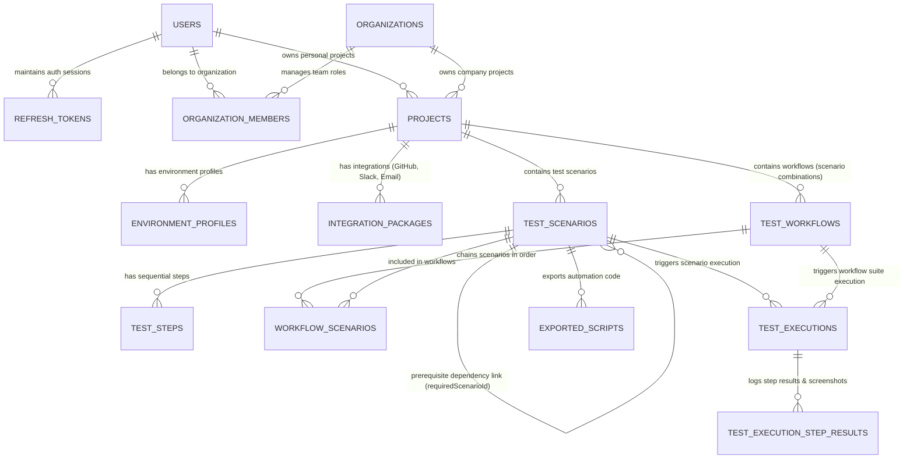

# TestLoom — Database Schema

Relational schema for TestLoom: tables, fields, data types, constraints, relationships, and sample JSON payloads. Every table follows a **standard audit + soft-delete convention** (§1) so behavior stays predictable across the whole schema.

For how these tables are used at runtime, see [`Architecture.md`](./Architecture.md).

---

## 1. Standard Audit & Soft-Delete Fields

Every table in this schema includes these seven fields. They are omitted from the per-table listings below to avoid repetition — assume every table has them **in addition to** its own columns.

| Field       | Type          | Constraints                                | What it's for                                                                                                                                                                         |
| :---------- | :------------ | :----------------------------------------- | :------------------------------------------------------------------------------------------------------------------------------------------------------------------------------------ |
| `id`        | `UUID`        | `PRIMARY KEY`, `DEFAULT gen_random_uuid()` | Unique identifier for the row. UUIDs avoid ID collisions across a multi-tenant system and don't leak row counts.                                                                      |
| `createdAt` | `TIMESTAMPTZ` | `NOT NULL`, `DEFAULT NOW()`                | When the row was first created. Used for sorting, auditing, and analytics.                                                                                                            |
| `createdBy` | `UUID`        | `NULLABLE`, `REFERENCES users(id)`         | Which user created the row. Nullable because some rows are system-generated (e.g. seed data).                                                                                         |
| `updatedAt` | `TIMESTAMPTZ` | `NOT NULL`, `DEFAULT NOW()`                | Last time any field on the row changed. Used for cache invalidation and "last edited" UI.                                                                                             |
| `updatedBy` | `UUID`        | `NULLABLE`, `REFERENCES users(id)`         | Who last edited the row.                                                                                                                                                              |
| `deletedAt` | `TIMESTAMPTZ` | `NULLABLE`                                 | **Soft-delete marker.** `NULL` = active row. A timestamp here means the row is treated as deleted without physically removing it — preserves referential integrity and audit history. |
| `deletedBy` | `UUID`        | `NULLABLE`, `REFERENCES users(id)`         | Who performed the soft delete.                                                                                                                                                        |

> **Convention rule:** `deletedAt` must always be `NULLABLE` on every table. A non-nullable `deletedAt` would mean every row is permanently "deleted," which breaks the soft-delete pattern. All application queries should filter `WHERE deletedAt IS NULL` unless explicitly querying deleted/archived data.

---

## 2. Entity-Relationship Overview



---

## Layer 1 — Authentication & User Profiles

### Table: `users`

Core identity table. Every other table's `createdBy`/`updatedBy`/`deletedBy` references this table.

| Column            | Type           | Constraints                   | What it's for                                                                                        |
| :---------------- | :------------- | :---------------------------- | :--------------------------------------------------------------------------------------------------- |
| `email`           | `VARCHAR(255)` | `NOT NULL`, `UNIQUE`, `INDEX` | Login identifier and contact address. Unique + indexed for fast auth lookups.                        |
| `passwordHash`    | `VARCHAR(255)` | `NULLABLE`                    | Bcrypt/argon2 hash of the password. `NULL` when the user signed up via OAuth (no password to store). |
| `fullName`        | `VARCHAR(100)` | `NOT NULL`                    | Display name shown across the UI (avatars, activity logs, execution history).                        |
| `avatarUrl`       | `TEXT`         | `NULLABLE`                    | Profile picture, shown in team member lists and audit trails.                                        |
| `isEmailVerified` | `BOOLEAN`      | `NOT NULL`, `DEFAULT false`   | Gates access to certain actions (e.g. creating a company org) until the user confirms their email.   |

**Sample JSON:**

```json
{
	"id": "u1111111-e89b-12d3-a456-426614174000",
	"email": "pawan@example.com",
	"passwordHash": "$2b$12$Kixs10Lqf8m1wZpQvN9k.e7WqJ8z3X2y1v0u",
	"fullName": "Pawan Kumar",
	"avatarUrl": "https://assets.testloom.com/avatars/pawan.png",
	"isEmailVerified": true,
	"createdAt": "2026-09-18T10:00:00.000Z",
	"createdBy": null,
	"updatedAt": "2026-09-18T10:00:00.000Z",
	"updatedBy": null,
	"deletedAt": null,
	"deletedBy": null
}
```

---

### Table: `refresh_tokens`

Manages long-lived JWT refresh sessions so users don't have to re-login constantly.

| Column      | Type           | Constraints                                          | What it's for                                                                          |
| :---------- | :------------- | :--------------------------------------------------- | :------------------------------------------------------------------------------------- |
| `userId`    | `UUID`         | `NOT NULL`, `REFERENCES users(id) ON DELETE CASCADE` | Which user this session belongs to. Cascades on user deletion.                         |
| `tokenHash` | `VARCHAR(255)` | `NOT NULL`, `UNIQUE`                                 | Hashed refresh token (never store the raw token) — used to verify and rotate sessions. |
| `expiresAt` | `TIMESTAMPTZ`  | `NOT NULL`                                           | When this refresh token stops being valid, forcing re-authentication.                  |

**Sample JSON:**

```json
{
	"id": "rt222222-e89b-12d3-a456-426614174001",
	"userId": "u1111111-e89b-12d3-a456-426614174000",
	"tokenHash": "e3b0c44298fc1c149afbf4c8996fb92427ae41e4649b934ca495991b7852b855",
	"expiresAt": "2026-10-18T10:00:00.000Z",
	"createdAt": "2026-09-18T10:00:00.000Z",
	"createdBy": "u1111111-e89b-12d3-a456-426614174000",
	"updatedAt": "2026-09-18T10:00:00.000Z",
	"updatedBy": "u1111111-e89b-12d3-a456-426614174000",
	"deletedAt": null,
	"deletedBy": null
}
```

---

## Layer 2 — Organizations & Membership

### Table: `organizations`

Represents a company-level tenant that owns projects and team members.

| Column             | Type           | Constraints                  | What it's for                                                                      |
| :----------------- | :------------- | :--------------------------- | :--------------------------------------------------------------------------------- |
| `name`             | `VARCHAR(150)` | `NOT NULL`                   | Company/team display name.                                                         |
| `slug`             | `VARCHAR(150)` | `NOT NULL`, `UNIQUE`         | URL-safe identifier used in routes (e.g. `/org/acme-corp`).                        |
| `logoUrl`          | `TEXT`         | `NULLABLE`                   | Company logo shown in the dashboard header.                                        |
| `subscriptionPlan` | `VARCHAR(20)`  | `NOT NULL`, `DEFAULT 'FREE'` | Reserved for future billing tiers (`FREE`/`PRO`/`ENTERPRISE`). Not enforced today. |

**Sample JSON:**

```json
{
	"id": "org33333-e89b-12d3-a456-426614174002",
	"name": "Acme Corp",
	"slug": "acme-corp",
	"logoUrl": "https://assets.testloom.com/logos/acme.png",
	"subscriptionPlan": "FREE",
	"createdAt": "2026-09-18T10:15:00.000Z",
	"createdBy": "u1111111-e89b-12d3-a456-426614174000",
	"updatedAt": "2026-09-18T10:15:00.000Z",
	"updatedBy": "u1111111-e89b-12d3-a456-426614174000",
	"deletedAt": null,
	"deletedBy": null
}
```

---

### Table: `organization_members`

Junction table linking users to organizations with a role. Also handles pending invites before the invited person has an account.

| Column           | Type           | Constraints                                                  | What it's for                                                                                    |
| :--------------- | :------------- | :----------------------------------------------------------- | :----------------------------------------------------------------------------------------------- |
| `organizationId` | `UUID`         | `NOT NULL`, `REFERENCES organizations(id) ON DELETE CASCADE` | Which organization this membership belongs to.                                                   |
| `userId`         | `UUID`         | `NULLABLE`, `REFERENCES users(id) ON DELETE CASCADE`         | The member's user account. `NULL` until an invited email accepts and creates an account.         |
| `invitedEmail`   | `VARCHAR(255)` | `NOT NULL`                                                   | Email address the invite was sent to — allows tracking a pending invite before `userId` exists.  |
| `role`           | `VARCHAR(20)`  | `NOT NULL`                                                   | One of `ADMIN`, `QA_ENGINEER`, `VIEWER`. Drives the permission matrix in `Architecture.md` §2.2. |
| `status`         | `VARCHAR(20)`  | `NOT NULL`, `DEFAULT 'PENDING'`                              | `PENDING` (invite sent, not accepted), `ACTIVE` (accepted), `REVOKED` (access removed).          |
| `joinedAt`       | `TIMESTAMPTZ`  | `NULLABLE`                                                   | When the invite was accepted and the member became active.                                       |

**Sample JSON:**

```json
{
	"id": "om444444-e89b-12d3-a456-426614174003",
	"organizationId": "org33333-e89b-12d3-a456-426614174002",
	"userId": "u1111111-e89b-12d3-a456-426614174000",
	"invitedEmail": "pawan@example.com",
	"role": "ADMIN",
	"status": "ACTIVE",
	"joinedAt": "2026-09-18T10:15:05.000Z",
	"createdAt": "2026-09-18T10:15:00.000Z",
	"createdBy": "u1111111-e89b-12d3-a456-426614174000",
	"updatedAt": "2026-09-18T10:15:05.000Z",
	"updatedBy": "u1111111-e89b-12d3-a456-426614174000",
	"deletedAt": null,
	"deletedBy": null
}
```

---

## Layer 3 — Projects, Environment Profiles & Integrations

### Table: `projects`

A web-testing project, owned either by an individual user or a company organization.

| Column           | Type           | Constraints                                                  | What it's for                                                                                                        |
| :--------------- | :------------- | :----------------------------------------------------------- | :------------------------------------------------------------------------------------------------------------------- |
| `userId`         | `UUID`         | `NULLABLE`, `REFERENCES users(id) ON DELETE CASCADE`         | Owner, if this is a **personal** project.                                                                            |
| `organizationId` | `UUID`         | `NULLABLE`, `REFERENCES organizations(id) ON DELETE CASCADE` | Owner, if this is a **company** project.                                                                             |
| `name`           | `VARCHAR(150)` | `NOT NULL`                                                   | Project display name (e.g. "E-Commerce Storefront").                                                                 |
| `description`    | `TEXT`         | `NULLABLE`                                                   | Free-text summary of what the project tests.                                                                         |
| `targetBaseUrl`  | `TEXT`         | `NOT NULL`                                                   | The web app under test — every scenario's relative `route` is resolved against this.                                 |
| `isHeadless`     | `BOOLEAN`      | `NOT NULL`, `DEFAULT true`                                   | `true` runs Playwright in the background; `false` opens a visible browser window (useful while debugging in Studio). |
| `viewportWidth`  | `INTEGER`      | `NOT NULL`, `DEFAULT 1280`                                   | Default browser viewport width for recording/replay.                                                                 |
| `viewportHeight` | `INTEGER`      | `NOT NULL`, `DEFAULT 720`                                    | Default browser viewport height.                                                                                     |
| `timeoutMs`      | `INTEGER`      | `NOT NULL`, `DEFAULT 30000`                                  | Default max wait time per step before it's marked `FAILED`.                                                          |

> **Invariant to enforce at the application layer:** exactly one of `userId` / `organizationId` must be set — never both, never neither. The schema allows both to be nullable for flexibility, but a `CHECK` constraint or service-layer validation should guarantee exclusivity.

**Sample JSON:**

```json
{
	"id": "p6666666-e89b-12d3-a456-426614174005",
	"userId": null,
	"organizationId": "org33333-e89b-12d3-a456-426614174002",
	"name": "E-Commerce Storefront",
	"description": "Main e-commerce web application testing suite",
	"targetBaseUrl": "https://staging.shop.example.com",
	"isHeadless": false,
	"viewportWidth": 1280,
	"viewportHeight": 720,
	"timeoutMs": 30000,
	"createdAt": "2026-09-18T10:20:00.000Z",
	"createdBy": "u1111111-e89b-12d3-a456-426614174000",
	"updatedAt": "2026-09-18T10:20:00.000Z",
	"updatedBy": "u1111111-e89b-12d3-a456-426614174000",
	"deletedAt": null,
	"deletedBy": null
}
```

---

### Table: `environment_profiles`

Named sets of environment variables/overrides attached to a project (e.g. "Staging Cluster" vs "Production US-East").

| Column            | Type           | Constraints                                             | What it's for                                                                                                       |
| :---------------- | :------------- | :------------------------------------------------------ | :------------------------------------------------------------------------------------------------------------------ |
| `projectId`       | `UUID`         | `NOT NULL`, `REFERENCES projects(id) ON DELETE CASCADE` | Which project this profile belongs to.                                                                              |
| `name`            | `VARCHAR(150)` | `NOT NULL`                                              | Profile label shown in the environment switcher.                                                                    |
| `baseUrlOverride` | `TEXT`         | `NULLABLE`                                              | Overrides `projects.targetBaseUrl` for this specific environment, if different.                                     |
| `variables`       | `JSONB`        | `NOT NULL`, `DEFAULT '{}'`                              | Key-value map resolved at replay time for steps using `ENVIRONMENT_VARIABLE` strategy (see `Architecture.md` §5.1). |

**Sample JSON:**

```json
{
	"id": "env77777-e89b-12d3-a456-426614174006",
	"projectId": "p6666666-e89b-12d3-a456-426614174005",
	"name": "Staging Cluster",
	"baseUrlOverride": "https://staging.shop.example.com",
	"variables": {
		"AUTH_TOKEN": "secret_stg_token_999",
		"TEST_USER_EMAIL": "testuser@example.com"
	},
	"createdAt": "2026-09-18T10:25:00.000Z",
	"createdBy": "u1111111-e89b-12d3-a456-426614174000",
	"updatedAt": "2026-09-18T10:25:00.000Z",
	"updatedBy": "u1111111-e89b-12d3-a456-426614174000",
	"deletedAt": null,
	"deletedBy": null
}
```

---

### Table: `integration_packages`

Third-party integrations attached to a project — GitHub webhooks, Slack alerts, or email reports.

| Column      | Type           | Constraints                                             | What it's for                                                                         |
| :---------- | :------------- | :------------------------------------------------------ | :------------------------------------------------------------------------------------ |
| `projectId` | `UUID`         | `NOT NULL`, `REFERENCES projects(id) ON DELETE CASCADE` | Which project this integration is attached to.                                        |
| `name`      | `VARCHAR(150)` | `NOT NULL`                                              | Human-readable label (e.g. "Slack #qa-alerts Channel").                               |
| `provider`  | `VARCHAR(50)`  | `NOT NULL`                                              | `GITHUB`, `SLACK`, or `EMAIL` — determines which handler processes `config`.          |
| `config`    | `JSONB`        | `NOT NULL`, `DEFAULT '{}'`                              | Provider-specific settings: webhook URLs, API tokens, channel names, recipient lists. |
| `isActive`  | `BOOLEAN`      | `NOT NULL`, `DEFAULT true`                              | Toggle to disable an integration without deleting its configuration.                  |

**Sample JSON:**

```json
{
	"id": "int88888-e89b-12d3-a456-426614174007",
	"projectId": "p6666666-e89b-12d3-a456-426614174005",
	"name": "Slack #qa-alerts Channel",
	"provider": "SLACK",
	"config": {
		"webhookUrl": "https://hooks.slack.com/services/T00/B00/XXXXX",
		"channelName": "#qa-alerts",
		"notifyOnFailureOnly": true
	},
	"isActive": true,
	"createdAt": "2026-09-18T10:30:00.000Z",
	"createdBy": "u1111111-e89b-12d3-a456-426614174000",
	"updatedAt": "2026-09-18T10:30:00.000Z",
	"updatedBy": "u1111111-e89b-12d3-a456-426614174000",
	"deletedAt": null,
	"deletedBy": null
}
```

---

## Layer 4 — Test Scenarios & Workflows

### Table: `test_scenarios`

An individual, reusable recorded test script for a specific page or action.

| Column               | Type           | Constraints                                             | What it's for                                                                                                                        |
| :------------------- | :------------- | :------------------------------------------------------ | :----------------------------------------------------------------------------------------------------------------------------------- |
| `projectId`          | `UUID`         | `NOT NULL`, `REFERENCES projects(id) ON DELETE CASCADE` | Which project this scenario belongs to.                                                                                              |
| `requiredScenarioId` | `UUID`         | `NULLABLE`, `REFERENCES test_scenarios(id)`             | Self-referencing prerequisite — this scenario assumes the referenced one already ran (e.g. "Company Create" requires "Login" first). |
| `title`              | `VARCHAR(200)` | `NOT NULL`                                              | Scenario name shown in the Studio and workflow builder.                                                                              |
| `description`        | `TEXT`         | `NULLABLE`                                              | What the scenario covers, for team documentation.                                                                                    |
| `route`              | `TEXT`         | `NOT NULL`, `DEFAULT '/'`                               | The relative path this scenario starts on (e.g. `/company`), resolved against `projects.targetBaseUrl`.                              |
| `status`             | `VARCHAR(20)`  | `NOT NULL`, `DEFAULT 'DRAFT'`                           | `DRAFT` (being recorded/edited), `READY` (safe to run), `ARCHIVED` (retired but kept for history).                                   |

**Sample JSON:**

```json
{
	"id": "sc100000-e89b-12d3-a456-426614174009",
	"projectId": "p6666666-e89b-12d3-a456-426614174005",
	"requiredScenarioId": "sc000000-e89b-12d3-a456-426614174008",
	"title": "Company Scenario",
	"description": "Navigates to company page, opens create modal, and verifies company record",
	"route": "/company",
	"status": "READY",
	"createdAt": "2026-09-18T11:00:00.000Z",
	"createdBy": "u1111111-e89b-12d3-a456-426614174000",
	"updatedAt": "2026-09-18T11:00:00.000Z",
	"updatedBy": "u1111111-e89b-12d3-a456-426614174000",
	"deletedAt": null,
	"deletedBy": null
}
```

---

### Table: `test_steps`

The ordered sequence of recorded interactions within a scenario — the most detail-heavy table in the schema.

| Column             | Type           | Constraints                                                   | What it's for                                                                                                                                                                                                                                                                                |
| :----------------- | :------------- | :------------------------------------------------------------ | :------------------------------------------------------------------------------------------------------------------------------------------------------------------------------------------------------------------------------------------------------------------------------------------- |
| `scenarioId`       | `UUID`         | `NOT NULL`, `REFERENCES test_scenarios(id) ON DELETE CASCADE` | Which scenario this step belongs to.                                                                                                                                                                                                                                                         |
| `stepOrder`        | `INTEGER`      | `NOT NULL`                                                    | 1-based position in the sequence — determines replay order.                                                                                                                                                                                                                                  |
| `actionType`       | `VARCHAR(30)`  | `NOT NULL`                                                    | What kind of action this is: `NAVIGATE`, `CLICK`, `TYPE`, `SELECT_OPTION`, `UPLOAD_FILE`, `HOVER`, `SCROLL`, `PRESS_KEY`, `ASSERT_VISIBLE`, `ASSERT_TEXT`, `ASSERT_URL`.                                                                                                                     |
| `primaryKey`       | `VARCHAR(30)`  | `NOT NULL`                                                    | Which key inside `selectorMetadata` to try **first** during replay (e.g. `"testId"`). Auto-defaulted on record, editable by a QA Engineer. See `Architecture.md` §6.                                                                                                                         |
| `selectorMetadata` | `JSONB`        | `NOT NULL`, `DEFAULT '{}'`                                    | Full multi-signal locator map captured at record time — every possible way to find this element again (`testId`, `id`, `name`, `ariaLabel`, `placeholder`, `labelText`, `textContent`, `tagName`, `xpath`, `cssPath`, `classList`, `attributes`). Powers the self-healing fallback pipeline. |
| `inputValue`       | `TEXT`         | `NULLABLE`                                                    | The value recorded during the session (e.g. `pawan@gmail.com`, `$500`, `true`). Used as the baseline before any replay strategy transforms it.                                                                                                                                               |
| `inputConfig`      | `JSONB`        | `NULLABLE`                                                    | `{ inputType, strategy }` — the detected field type and chosen replay strategy (`DETERMINISTIC_EXACT` / `DYNAMIC_AUTO_GENERATE` / `ENVIRONMENT_VARIABLE` / `RANDOM_OPTION`). See `Architecture.md` §5.                                                                                       |
| `description`      | `VARCHAR(255)` | `NULLABLE`                                                    | Human-readable label for this step, shown in the step list panel (e.g. "Click 'Create Company' button").                                                                                                                                                                                     |

**Sample JSON:**

```json
{
	"id": "st110000-e89b-12d3-a456-426614174010",
	"scenarioId": "sc100000-e89b-12d3-a456-426614174009",
	"stepOrder": 2,
	"actionType": "CLICK",
	"primaryKey": "testId",
	"selectorMetadata": {
		"testId": "create-company-btn",
		"id": "btn-create-company",
		"name": "createCompany",
		"ariaLabel": "Create New Company",
		"role": "button",
		"placeholder": null,
		"labelText": "Company Name",
		"textContent": "Create Company",
		"tagName": "BUTTON",
		"xpath": "//button[contains(text(), 'Create Company')]",
		"cssPath": "div.modal-content > form > div.flex > button.btn-primary",
		"classList": ["btn", "btn-primary", "w-full", "shadow-sm"],
		"attributes": {
			"type": "submit",
			"data-modal-target": "company-modal"
		}
	},
	"inputValue": null,
	"inputConfig": null,
	"description": "Click 'Create Company' button",
	"createdAt": "2026-09-18T11:02:00.000Z",
	"createdBy": "u1111111-e89b-12d3-a456-426614174000",
	"updatedAt": "2026-09-18T11:02:00.000Z",
	"updatedBy": "u1111111-e89b-12d3-a456-426614174000",
	"deletedAt": null,
	"deletedBy": null
}
```

**Sample JSON — a text input step (dynamic strategy):**

```json
{
	"id": "st110001-e89b-12d3-a456-426614174010",
	"scenarioId": "sc100000-e89b-12d3-a456-426614174009",
	"stepOrder": 3,
	"actionType": "TYPE",
	"primaryKey": "id",
	"selectorMetadata": {
		"testId": null,
		"id": "company-email-input",
		"name": "email",
		"ariaLabel": null,
		"placeholder": "Enter email",
		"labelText": "Email Address",
		"textContent": null,
		"tagName": "INPUT",
		"xpath": "//input[@id='company-email-input']",
		"cssPath": "form > div:nth-child(2) > input",
		"classList": ["form-input"],
		"attributes": { "type": "email" }
	},
	"inputValue": "pawan@gmail.com",
	"inputConfig": {
		"inputType": "EMAIL",
		"strategy": "DYNAMIC_AUTO_GENERATE"
	},
	"description": "Type email into Company Email field",
	"createdAt": "2026-09-18T11:02:30.000Z",
	"createdBy": "u1111111-e89b-12d3-a456-426614174000",
	"updatedAt": "2026-09-18T11:02:30.000Z",
	"updatedBy": "u1111111-e89b-12d3-a456-426614174000",
	"deletedAt": null,
	"deletedBy": null
}
```

---

### Table: `test_workflows`

A named suite chaining multiple scenarios into a complete user journey.

| Column        | Type           | Constraints                                             | What it's for                                        |
| :------------ | :------------- | :------------------------------------------------------ | :--------------------------------------------------- |
| `projectId`   | `UUID`         | `NOT NULL`, `REFERENCES projects(id) ON DELETE CASCADE` | Which project this workflow belongs to.              |
| `name`        | `VARCHAR(200)` | `NOT NULL`                                              | Workflow title (e.g. "Admin Full Journey Workflow"). |
| `description` | `TEXT`         | `NULLABLE`                                              | What journey this workflow represents.               |

**Sample JSON:**

```json
{
	"id": "wf120000-e89b-12d3-a456-426614174011",
	"projectId": "p6666666-e89b-12d3-a456-426614174005",
	"name": "Admin Full Journey Workflow",
	"description": "Combines Login, Dashboard View, Company Create, and Company View scenarios",
	"createdAt": "2026-09-18T11:10:00.000Z",
	"createdBy": "u1111111-e89b-12d3-a456-426614174000",
	"updatedAt": "2026-09-18T11:10:00.000Z",
	"updatedBy": "u1111111-e89b-12d3-a456-426614174000",
	"deletedAt": null,
	"deletedBy": null
}
```

---

### Table: `workflow_scenarios`

Junction table linking scenarios to workflows with an explicit execution order.

| Column           | Type      | Constraints                                                   | What it's for                                                                                                            |
| :--------------- | :-------- | :------------------------------------------------------------ | :----------------------------------------------------------------------------------------------------------------------- |
| `workflowId`     | `UUID`    | `NOT NULL`, `REFERENCES test_workflows(id) ON DELETE CASCADE` | Which workflow this mapping belongs to.                                                                                  |
| `scenarioId`     | `UUID`    | `NOT NULL`, `REFERENCES test_scenarios(id) ON DELETE CASCADE` | Which scenario is included.                                                                                              |
| `executionOrder` | `INTEGER` | `NOT NULL`                                                    | Position in the run sequence (1 = runs first). Determines the order scenarios execute inside the shared browser context. |

**Sample JSON:**

```json
{
	"id": "ws130000-e89b-12d3-a456-426614174012",
	"workflowId": "wf120000-e89b-12d3-a456-426614174011",
	"scenarioId": "sc100000-e89b-12d3-a456-426614174009",
	"executionOrder": 3,
	"createdAt": "2026-09-18T11:12:00.000Z",
	"createdBy": "u1111111-e89b-12d3-a456-426614174000",
	"updatedAt": "2026-09-18T11:12:00.000Z",
	"updatedBy": "u1111111-e89b-12d3-a456-426614174000",
	"deletedAt": null,
	"deletedBy": null
}
```

---

## Layer 5 — Execution History & Step Logging

### Table: `test_executions`

Tracks every replay run — of either a single scenario or a full workflow suite.

| Column             | Type          | Constraints                                                   | What it's for                                                                              |
| :----------------- | :------------ | :------------------------------------------------------------ | :----------------------------------------------------------------------------------------- |
| `projectId`        | `UUID`        | `NOT NULL`, `REFERENCES projects(id) ON DELETE CASCADE`       | Which project this run belongs to.                                                         |
| `scenarioId`       | `UUID`        | `NULLABLE`, `REFERENCES test_scenarios(id) ON DELETE CASCADE` | Set if this run was a single scenario (mutually exclusive with `workflowId`).              |
| `workflowId`       | `UUID`        | `NULLABLE`, `REFERENCES test_workflows(id) ON DELETE CASCADE` | Set if this run was a full workflow (mutually exclusive with `scenarioId`).                |
| `executedByUserId` | `UUID`        | `NOT NULL`, `REFERENCES users(id)`                            | Who triggered the run — for audit and accountability.                                      |
| `status`           | `VARCHAR(20)` | `NOT NULL`, `DEFAULT 'PENDING'`                               | `PENDING` → `RUNNING` → `PASSED`/`FAILED`/`CANCELLED`. Drives the UI's live run indicator. |
| `totalSteps`       | `INTEGER`     | `NOT NULL`, `DEFAULT 0`                                       | Total number of steps in this run (across all chained scenarios if a workflow).            |
| `passedSteps`      | `INTEGER`     | `NOT NULL`, `DEFAULT 0`                                       | Running/final count of steps that passed.                                                  |
| `failedSteps`      | `INTEGER`     | `NOT NULL`, `DEFAULT 0`                                       | Running/final count of steps that failed.                                                  |
| `durationMs`       | `INTEGER`     | `NULLABLE`                                                    | Total wall-clock time for the run, once complete.                                          |
| `errorMessage`     | `TEXT`        | `NULLABLE`                                                    | Top-level failure reason, if the run failed outright (e.g. browser crash).                 |
| `startedAt`        | `TIMESTAMPTZ` | `NOT NULL`, `DEFAULT NOW()`                                   | When execution began.                                                                      |
| `completedAt`      | `TIMESTAMPTZ` | `NULLABLE`                                                    | When execution finished — `NULL` while still `RUNNING`.                                    |

> Exactly one of `scenarioId` / `workflowId` should be set per run — enforce at the application layer.

**Sample JSON:**

```json
{
	"id": "ex140000-e89b-12d3-a456-426614174013",
	"projectId": "p6666666-e89b-12d3-a456-426614174005",
	"scenarioId": null,
	"workflowId": "wf120000-e89b-12d3-a456-426614174011",
	"executedByUserId": "u1111111-e89b-12d3-a456-426614174000",
	"status": "PASSED",
	"totalSteps": 12,
	"passedSteps": 12,
	"failedSteps": 0,
	"durationMs": 4850,
	"errorMessage": null,
	"startedAt": "2026-09-18T11:20:00.000Z",
	"completedAt": "2026-09-18T11:20:04.850Z",
	"createdAt": "2026-09-18T11:20:00.000Z",
	"createdBy": "u1111111-e89b-12d3-a456-426614174000",
	"updatedAt": "2026-09-18T11:20:04.850Z",
	"updatedBy": "u1111111-e89b-12d3-a456-426614174000",
	"deletedAt": null,
	"deletedBy": null
}
```

---

### Table: `test_execution_step_results`

Detailed per-step log entries for every test run — this is what powers the execution report and screenshot gallery.

| Column          | Type          | Constraints                                                    | What it's for                                                                                |
| :-------------- | :------------ | :------------------------------------------------------------- | :------------------------------------------------------------------------------------------- |
| `executionId`   | `UUID`        | `NOT NULL`, `REFERENCES test_executions(id) ON DELETE CASCADE` | Which run this result belongs to.                                                            |
| `stepId`        | `UUID`        | `NOT NULL`, `REFERENCES test_steps(id)`                        | Which recorded step was executed.                                                            |
| `status`        | `VARCHAR(20)` | `NOT NULL`                                                     | `PASSED`, `FAILED`, or `SKIPPED` (e.g. skipped because an earlier step in the chain failed). |
| `durationMs`    | `INTEGER`     | `NOT NULL`                                                     | How long this individual step took to execute.                                               |
| `errorMessage`  | `TEXT`        | `NULLABLE`                                                     | Stack trace / failure detail, if `status = FAILED`.                                          |
| `screenshotUrl` | `TEXT`        | `NULLABLE`                                                     | Captured screenshot for this step, shown in the execution report.                            |
| `executedAt`    | `TIMESTAMPTZ` | `NOT NULL`, `DEFAULT NOW()`                                    | When this specific step completed.                                                           |

> **Corrected from earlier draft:** `deletedAt` on this table must be `NULLABLE` (not `NOT NULL`), consistent with the soft-delete convention in §1.

**Sample JSON:**

```json
{
	"id": "sr150000-e89b-12d3-a456-426614174014",
	"executionId": "ex140000-e89b-12d3-a456-426614174013",
	"stepId": "st110000-e89b-12d3-a456-426614174010",
	"status": "PASSED",
	"durationMs": 350,
	"errorMessage": null,
	"screenshotUrl": "https://assets.testloom.com/screenshots/ex140000/step_2.png",
	"executedAt": "2026-09-18T11:20:00.350Z",
	"createdAt": "2026-09-18T11:20:00.350Z",
	"createdBy": "u1111111-e89b-12d3-a456-426614174000",
	"updatedAt": "2026-09-18T11:20:00.350Z",
	"updatedBy": "u1111111-e89b-12d3-a456-426614174000",
	"deletedAt": null,
	"deletedBy": null
}
```

---

## Layer 6 — Code Export History

### Table: `exported_scripts`

History of every code export generated from a scenario.

| Column            | Type          | Constraints                                                   | What it's for                                                                                                 |
| :---------------- | :------------ | :------------------------------------------------------------ | :------------------------------------------------------------------------------------------------------------ |
| `scenarioId`      | `UUID`        | `NOT NULL`, `REFERENCES test_scenarios(id) ON DELETE CASCADE` | Which scenario this export was generated from.                                                                |
| `targetFramework` | `VARCHAR(30)` | `NOT NULL`                                                    | `PLAYWRIGHT_TS`, `CYPRESS_JS`, `SELENIUM_PYTHON`, or `CUCUMBER_GHERKIN` — determines the code generator used. |
| `codeContent`     | `TEXT`        | `NOT NULL`                                                    | The full generated script, stored for re-download without regenerating.                                       |

**Sample JSON:**

```json
{
	"id": "exp160000-e89b-12d3-a456-426614174015",
	"scenarioId": "sc100000-e89b-12d3-a456-426614174009",
	"targetFramework": "PLAYWRIGHT_TS",
	"codeContent": "import { test, expect } from '@playwright/test';\n\ntest('Company Scenario', async ({ page }) => {\n  await page.goto('https://staging.shop.example.com/company');\n  await page.locator('#user-email').fill(`pawan+${Date.now()}@suretyseven.com`);\n  await page.locator('input[type=\"radio\"][value=\"ENTERPRISE\"]').check();\n  await page.locator('#agree-terms-checkbox').check();\n  await expect(page.locator('.company-details')).toBeVisible();\n});",
	"createdAt": "2026-09-18T11:25:00.000Z",
	"createdBy": "u1111111-e89b-12d3-a456-426614174000",
	"updatedAt": "2026-09-18T11:25:00.000Z",
	"updatedBy": "u1111111-e89b-12d3-a456-426614174000",
	"deletedAt": null,
	"deletedBy": null
}
```

---

## 3. Indexes for High-Performance Queries

```sql
-- Project & Organization Lookups
CREATE INDEX idx_projects_user ON projects(userId) WHERE deletedAt IS NULL;
CREATE INDEX idx_projects_org ON projects(organizationId) WHERE deletedAt IS NULL;
CREATE INDEX idx_org_members_user_org ON organization_members(userId, organizationId) WHERE deletedAt IS NULL;

-- Scenario & Step Lookups
CREATE INDEX idx_scenarios_project ON test_scenarios(projectId, status) WHERE deletedAt IS NULL;
CREATE INDEX idx_scenarios_required ON test_scenarios(requiredScenarioId) WHERE deletedAt IS NULL;
CREATE INDEX idx_steps_scenario_order ON test_steps(scenarioId, stepOrder ASC) WHERE deletedAt IS NULL;

-- Workflow Chaining Lookups
CREATE INDEX idx_workflows_project ON test_workflows(projectId) WHERE deletedAt IS NULL;
CREATE INDEX idx_workflow_scenarios_order ON workflow_scenarios(workflowId, executionOrder ASC) WHERE deletedAt IS NULL;

-- Execution Runs & Logging Lookups
CREATE INDEX idx_executions_scenario ON test_executions(scenarioId, startedAt DESC) WHERE deletedAt IS NULL;
CREATE INDEX idx_executions_project ON test_executions(projectId, startedAt DESC) WHERE deletedAt IS NULL;
CREATE INDEX idx_step_results_execution ON test_execution_step_results(executionId) WHERE deletedAt IS NULL;
```
