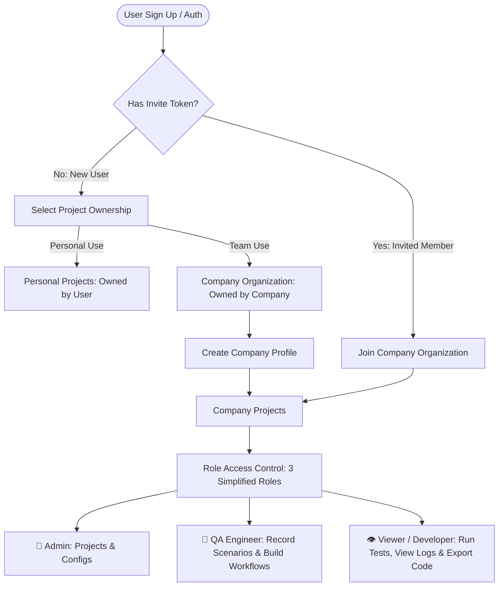
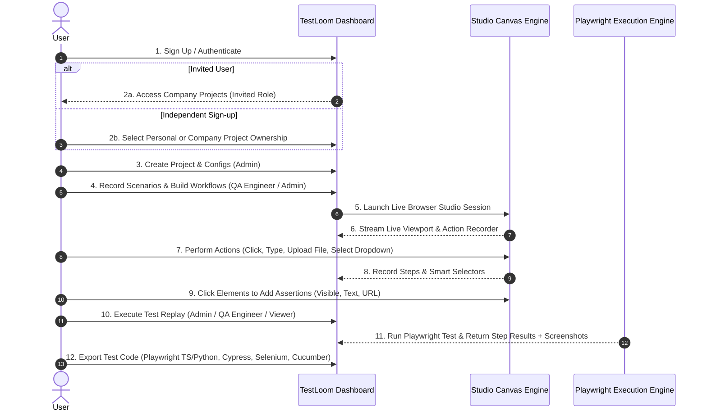

# TestLoom Platform Overview & SaaS Architecture

Welcome to the **TestLoom Architecture & Product Specification**. This document outlines the project vision, core capabilities, 3-Role Access Model, onboarding journey, and project organization rules for TestLoom.

---

## 1. Executive Summary & Vision

**TestLoom** is an enterprise-grade **No-Code / Low-Code Web Test Automation & Recording Platform** built as a modern, cloud-native alternative to platforms like Bugbug.io, Cypress Studio, and Playwright Codegen.

It enables QA engineers, software developers, and product managers to record real-world browser interactions on live web applications, attach visual assertion checkpoints, execute automated test replays, and export tests into executable code across multiple frameworks and programming languages.

---

## 2. Streamlined Architecture & Role Governance

TestLoom implements a **Direct Multi-Tenant Model** governed by a **3-Role Access Control Model** (`ADMIN`, `QA_ENGINEER`, `VIEWER`).

---

## 3. Scenarios vs. Workflows Concept & Session Continuity

TestLoom organizes test assets into **Scenarios** and **Workflows** inside a **Project**:

* **Test Scenario**: An individual recorded test script for a specific page or action.
  * *Scenario 1*: `Login Scenario`
  * *Scenario 2*: `Dashboard View Scenario`
  * *Scenario 3*: `Company Create Scenario`
  * *Scenario 4*: `Company View Scenario`

* **Test Workflow**: A sequence / suite chaining multiple scenarios together into a complete user journey.
  * *Admin Workflow* = `Login Scenario` ➔ `Dashboard View Scenario` ➔ `Company Create Scenario` ➔ `Company View Scenario`.

### 🔄 In-Memory Session Continuity across Workflows
When executing a **Workflow** (a chain of scenarios):
1. TestLoom initializes **a single shared Playwright Browser Context** for the entire workflow run.
2. After `Scenario 1 (Login)` completes, the browser session cookies and authentication headers remain active **in memory**.
3. `Scenario 2 (Dashboard View)`, `Scenario 3 (Company Create)`, and `Scenario 4 (Company View)` execute sequentially in the **exact same active browser session** without logging in again!
4. The browser context is closed only after the entire workflow run completes.

---

## 4. Future-Proof Pricing & Subscription Adaptability

TestLoom is designed to be **Subscription-Ready**:
* **`organizations` / `users`** tables contain `subscriptionPlan` (`FREE`, `PRO`, `ENTERPRISE`) defaulting to `'FREE'`.
* When payment integration (Stripe / Razorpay / LemonSqueezy) is enabled in the future, no database refactoring will be required.

---

## 5. Simplified 3-Role Permission Matrix

TestLoom defines **3 Core Roles** mapped directly to system tasks:

| System Task / Capability | 👑 Admin | 🧪 QA Engineer | 👁️ Viewer / Developer |
| :--- | :---: | :---: | :---: |
| **Manage Team Invites & Roles** | ✅ | ❌ | ❌ |
| **Create & Delete Projects** | ✅ | ❌ | ❌ |
| **Configure Base URL, Viewport & Env Vars** | ✅ | ❌ | ❌ |
| **Record Test Scenarios in Studio** | ✅ | ✅ | ❌ |
| **Edit Test Steps & Visual Assertions** | ✅ | ✅ | ❌ |
| **Create & Manage Workflows (Suites)** | ✅ | ✅ | ❌ |
| **Run Test Replays & Executions** | ✅ | ✅ | ✅ |
| **View Execution Logs & Screenshots** | ✅ | ✅ | ✅ |
| **Export Automation Code Scripts** | ✅ | ✅ | ✅ |

---

## 5. End-to-End User Journey (How It Works)

---

## 6. Repository Architecture & Coding Guidelines

Per the project rules in `AGENTS.md`:

* **`app/(auth)/`**: User Sign Up, Log In, and Organization invite acceptance routes.
* **`app/(dashboard)/`**: Projects management dashboard and Company team management.
* **`app/(dashboard)/projects/[id]/workspace/`**: Interactive TestLoom Studio canvas & recorder.
* **`app/api/`**: Thin API controller endpoints delegating all business logic to backend services.
* **`components/ui/`**: Base primitive UI components (Shadcn / Base-UI) — **IMMUTABLE**.
* **`components/shared/`**: Global reusable components (`ThemeToggle`, `ColorToggle`).
* **`components/pages/<page>/_components/`**: Page-exclusive components (canvas viewport, step list panel, export modal).
* **`lib/<service-name>/`**: Feature services adhering strictly to two files (`types.ts` and `<service-name>.service.ts`).

